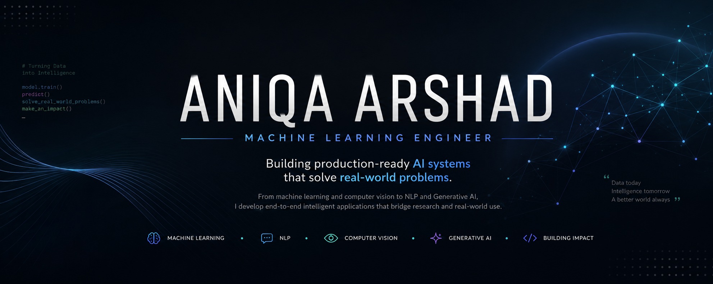

  

# Aniqa Arshad

### Machine Learning Engineer

> **Building production-ready AI systems that solve real-world problems.**

From machine learning and computer vision to NLP and Generative AI, I develop end-to-end intelligent applications that bridge research and real-world use.

  

  

## About

I'm a **Machine Learning Engineer** focused on building intelligent systems that bridge machine learning research and real-world applications.

My work spans **Machine Learning, Deep Learning, Computer Vision, Natural Language Processing, Recommendation Systems, and Generative AI**, with a strong emphasis on developing complete AI products rather than isolated models.

From data collection and preprocessing to model training, backend development, and deployment, I enjoy engineering AI solutions that are practical, explainable, scalable, and built for real-world use.
------

# Selected Projects

## 🧭 Safar — AI-Powered Explainable Travel Planning System

Developed an end-to-end AI travel planning platform that generates personalized and explainable travel itineraries using Retrieval-Augmented Generation (RAG), semantic search, and LLM-powered reasoning. The system combines user preferences, budget, and trip duration to deliver transparent recommendations through a production-ready backend architecture.

### Technologies

`Python` `Flask` `MongoDB` `LangGraph` `ChromaDB` `Sentence Transformers` `Ollama` `Docker`

### Demonstrates

`RAG Architecture` `LLM Integration` `Backend Engineering` `Vector Search` `Explainable AI`

---

## 🎭 Celebrity Face Recognition

Designed and implemented a deep learning-based facial recognition system using Convolutional Neural Networks (CNNs). The project covers the complete computer vision pipeline, including image preprocessing, augmentation, model training, evaluation, and real-time prediction.

### Technologies

`Python` `TensorFlow` `Keras` `OpenCV` `NumPy`

### Demonstrates

`Deep Learning` `Computer Vision` `CNNs` `Image Processing` `Model Training`

---

## 📰 Fake News Detection

Built an NLP-powered misinformation detection system that classifies news articles as real or fake using feature engineering and comparative machine learning. Evaluated multiple classification algorithms to identify the best-performing model.

### Technologies

`Python` `Scikit-learn` `Pandas` `NumPy` `TF-IDF`

### Demonstrates

`Natural Language Processing` `Feature Engineering` `Text Classification` `Model Evaluation`

---

## 🎯 AI Career Recommendation System

Developed an intelligent recommendation engine that matches users with suitable career paths using Natural Language Processing and semantic similarity techniques. The system generates personalized career recommendations based on user interests and skills.

### Technologies

`Python` `Scikit-learn` `TF-IDF` `Cosine Similarity` `Pandas`

### Demonstrates

`Recommendation Systems` `Semantic Search` `Natural Language Processing` `Information Retrieval`

---

# Engineering Toolkit

<table>
<tr>
<td valign="top" width="50%">

### 💻 Languages
- Python
- SQL

### 🤖 Machine Learning
- Scikit-learn
- TensorFlow
- Keras

### 👁️ Computer Vision
- OpenCV

</td>

<td valign="top" width="50%">

### 🧠 Generative AI
- LangChain
- LangGraph
- ChromaDB
- Sentence Transformers
- Ollama
- RAG

### ⚙️ Backend
- Flask
- REST APIs
- JWT Authentication

</td>
</tr>

<tr>
<td>

### 🗄️ Databases
- MongoDB
- SQLite

</td>

<td>

### 🛠️ Tools
- Git
- Docker
- Selenium
- Power BI
- Jupyter Notebook

</td>
</tr>
</table>

---

# Engineering Philosophy

> *"Great AI isn't measured only by model accuracy—it's measured by the value it creates."*

I believe intelligent systems should be **practical, explainable, and built for real-world use**. My approach combines machine learning with strong software engineering principles to develop end-to-end AI applications that are scalable, maintainable, and user-focused.

---

# Currently Exploring

- 🚀 Agentic AI Systems
- 🧠 Advanced Retrieval-Augmented Generation (RAG)
- 📊 LLM Evaluation & Optimization
- ⚙️ MLOps & Production Deployment
- 🌐 Scalable AI Backend Architecture
- ---

# GitHub Analytics

---

# Let's Connect

---

### ⭐ *Building AI that solves real-world problems.*

